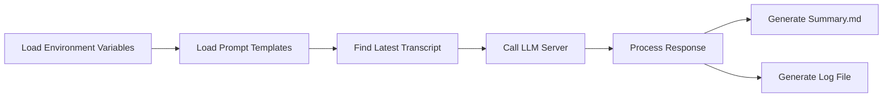

# Meeting Summarizer

An automated meeting summarization tool that processes transcript files and generates AI-powered summaries using large language models.

## Features
- 🕒 Automatically detects latest transcript file in target folder
- 🤖 Supports Local run LLM services like LM Studio or Ollama via OpenAI-compatible API
- 📝 Processes .txt, .srt, and .md file formats
- 📊 Generates both clean summaries and detailed processing logs
- ⚙️ Configurable via environment variables and prompt templates

## Workflow Diagram



## Installation

```bash
# Create and activate virtual environment (recommended)
python -m venv venv
source venv/bin/activate  # Linux/Mac
.\venv\Scripts\activate  # Windows

# Install dependencies
pip install -r requirements.txt
```

## Configuration

1. Create `.env` file with these variables:
```ini
API_KEY='lm-studio'
LLM_SERVER_BASE_URL="http://localhost:1234/v1"
LLM_MODEL="e.g.: deepseek-r1-distill-qwen-25.5b-brainstorm"
TEMPERATURE=0.6
TARGET_FOLDER="folder-with-transcripts"
```
Feel free to read this blog post for more details: [Meeting Summarizer via LM Studio Local Run | Klyn's Space🪐](https://klynwuuxyz.montaigne.io/thoughts-from-work/meeting-summarizer-via-lm-studio-local-run)


2. Set up prompt templates in `prompts/` directory:
```yaml
# system_prompts.yaml
system_prompt_meeting_summarizer: |
  You are an expert meeting summarizer...
```

## Usage

1. Place transcript files in the `TARGET_FOLDER` (default: ./transcripts)
2. Run the summarizer:
```bash
python meeting_summarizer_v1.py
```

## Output Files
- `[FILENAME]_summary.md`: Clean meeting summary
- `[FILENAME].log`: Full processing log including raw LLM response

## Supported File Formats
- Text files (.txt)
- Subtitle files (.srt)
- Markdown files (.md)

## Dependencies
- Python 3.10+ should be fine, mine is 3.11
- See `requirements.txt` for package dependencies


Key components explained in the Mermaid diagram:

1. **Environment Setup**: Loads config from `.env` and prompt templates
2. **Transcript Handling**: Finds latest compatible file in target folder
3. **LLM Processing**: Sends structured prompt to language model
4. **Output Generation**: Creates cleaned summary and detailed log files

The diagram shows the linear workflow from configuration loading through to final output generation, highlighting the key stages of the summarization process.